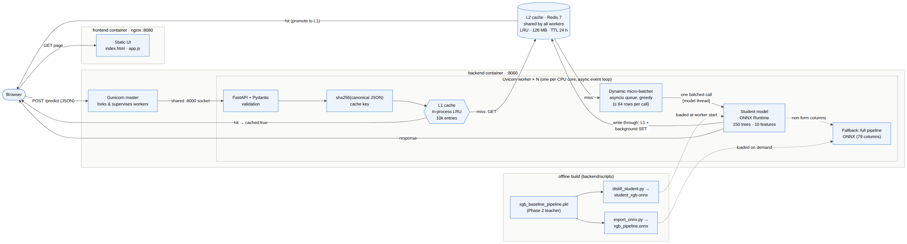

# House Prices — Model Service (SYS-304)

## Problem
Predict the final sale price (`SalePrice`) of residential homes in Ames, Iowa, given 79
explanatory variables describing each property (size, quality, location, year built, garage,
basement, etc.). This is a **tabular regression** problem.

## Dataset
[House Prices - Advanced Regression Techniques](https://www.kaggle.com/competitions/house-prices-advanced-regression-techniques)
(Kaggle competition, based on the Ames Housing Dataset compiled by Dean De Cock).

- `data/train.csv` — 1460 labeled examples, 79 features + `SalePrice`
- `data/test.csv` — 1459 unlabeled examples, 79 features (for optional Kaggle submission)
- `data/submission.csv` — generated by the notebook (optional, not required by the milestone)

## Why this dataset
It's a well-understood, cleanly-formatted regression problem with a mix of numeric and
categorical features and realistic messiness (missing values, skewed target), which makes it a
good testbed for building out system architecture (data pipeline → training → evaluation →
serialized weights) before adding complexity.

## Baseline approach
- **EDA:** missingness by column, target (`SalePrice`) distribution and skew, top numeric
  correlations with the target.
- **Preprocessing:** a single `sklearn` `ColumnTransformer` — median imputation + scaling for
  numeric columns, most-frequent imputation + one-hot encoding for categorical columns. Target
  is trained on `log1p(SalePrice)` to correct for right-skew (and to align with the
  competition's RMSLE metric).
- **Model:** `XGBRegressor` with light, untuned hyperparameters — a naive baseline, not a
  tuned/SOTA model.
- **Evaluation:** RMSE (log scale, comparable to Kaggle's RMSLE), RMSE/MAE in dollars, R².

## Results (validation set, 20% holdout)
| Metric | Value |
|---|---|
| RMSE (log scale / ~RMSLE) | 0.133 |
| RMSE ($) | ~$26,271 |
| MAE ($) | ~$15,788 |
| R² | 0.910 |

## Repo structure
```
.
├── README.md
├── deploy.sh                     # one-command launch of the whole stack
├── docker-compose.yml
├── ruff.toml / pytest.ini
├── requirements.txt              # Milestone 1 notebook environment
├── requirements-dev.txt          # backend deps + pytest + ruff
├── .github/workflows/ci.yml      # lint, tests, container build + smoke test
├── data/
│   ├── train.csv  test.csv  submission.csv
├── notebooks/
│   └── house_prices_baseline.ipynb
├── models/
│   └── xgb_baseline_pipeline.pkl # preprocessing + model, one artefact
├── backend/                      # FastAPI service  (see backend/docs/README.md)
│   ├── app/{main,schemas,model,reference,config}.py, defaults.json
│   ├── scripts/generate_defaults.py
│   ├── tests/
│   ├── requirements.txt
│   └── Dockerfile
└── frontend/                     # static UI       (see frontend/docs/README.md)
    ├── index.html  app.js  style.css  config.js
    ├── nginx.conf  docker-entrypoint.sh
    ├── tests/
    └── Dockerfile
```

## Milestone 1 — reproducing the notebook
```bash
pip install -r requirements.txt
jupyter notebook notebooks/house_prices_baseline.ipynb
```
The saved pipeline in `models/xgb_baseline_pipeline.pkl` can be loaded directly with
`joblib.load(...)` and called with raw (unprocessed) feature rows — preprocessing is baked
into the pipeline.


---

# Milestone 2 — Deploying the model service

The Milestone 1 pipeline is now served over HTTP, driven by a web UI, packaged
into two containers, and covered by CI.

## Quick start

```bash
git clone https://github.com/Nunthatinnv/SYS-304-SCALABLE-ALGORITHMS-AND-INFRASTRUCTURE.git
cd SYS-304-SCALABLE-ALGORITHMS-AND-INFRASTRUCTURE
./deploy.sh
```

That builds both images, starts them, and waits until the API reports healthy.

| Service | URL |
|---|---|
| Frontend UI | http://localhost:8080 |
| API docs (Swagger) | http://localhost:8000/docs |
| Health check | http://localhost:8000/health |

```bash
./deploy.sh --logs    # follow backend logs
./deploy.sh --down    # stop and remove the stack
```

Ports are configurable: `BACKEND_PORT=9000 FRONTEND_PORT=9090 ./deploy.sh`.

## Architecture

```
browser  ──HTTP──▶  frontend container        (nginx, static HTML/CSS/JS, :8080)
   │
   └──── fetch ───▶  backend container        (FastAPI + uvicorn, :8000)
                        └── models/xgb_baseline_pipeline.pkl
                              (ColumnTransformer + XGBRegressor)
```

The browser calls the API directly, so the frontend container never proxies
requests. Both containers are defined in `docker-compose.yml`; the frontend
starts only once the backend healthcheck passes.

The user fills in 10 fields. The backend widens that to the 79 raw columns the
pipeline expects, using medians and modes frozen from `data/train.csv` into
`backend/app/defaults.json`, then inverts the `log1p` target transform.

## API

| Method | Path | Purpose |
|---|---|---|
| `GET` | `/health` | Liveness and whether the model is loaded |
| `GET` | `/schema` | Field descriptions the frontend renders its form from |
| `POST` | `/predict` | Predict `SalePrice` for one house |

```bash
curl -X POST http://localhost:8000/predict \
  -H 'Content-Type: application/json' \
  -d '{"OverallQual":7,"GrLivArea":1710,"TotalBsmtSF":856,"1stFlrSF":856,
       "YearBuilt":2003,"GarageCars":2,"FullBath":2,"TotRmsAbvGrd":8,
       "LotArea":8450,"Neighborhood":"CollgCr"}'
```

## Development

```bash
python -m venv .venv && source .venv/bin/activate
pip install -r requirements-dev.txt

uvicorn backend.app.main:app --reload --port 8000   # run the API
pytest                                              # all tests
ruff check . && ruff format --check .               # lint
```

Python 3.12 is required: the pinned `scikit-learn` and `pandas` versions are the
ones that produced the pickle, and they need 3.11+.

## CI

`.github/workflows/ci.yml` runs on every push and pull request to `main`:

1. **lint-and-test** — install dependencies, `ruff check` + `ruff format
   --check`, then `pytest` (unit tests for the reference metadata, schemas and
   model; integration tests through the real FastAPI app).
2. **docker-build** — `docker compose build`, start the stack, and smoke test
   `/health`, the frontend root, and a real `/predict` call.

## Component documentation

- [`backend/docs/README.md`](backend/docs/README.md) — service design, endpoint
  reference, `defaults.json`, configuration, tests.
- [`frontend/docs/README.md`](frontend/docs/README.md) — UI structure, why the
  form is schema-driven, container configuration, tests.

---

# Milestone 3 — Architectural scaling & optimisation

Full write-up with benchmark tables, charts and the architecture diagram:
[`docs/SYS-304_Phase3_Report.pdf`](docs/SYS-304_Phase3_Report.pdf).

**Headline (64 concurrent clients, 2 vCPU):** 65 → 2,680 req/s on unique traffic
(41×), 68 → 5,947 req/s on repeated traffic (87×), p95 1,369 ms → 43 ms. Model
inference 10.5 ms → 11 µs with validation RMSE +0.0008 (log price).

## Week 5 — model-level

| Technique | Where | Effect |
|---|---|---|
| **ONNX export** of the full pipeline (with fixes for XGBoost's sparse-zero-as-missing semantics and float64 scaler precision; parity 1.8e-5) | `backend/scripts/export_onnx.py` → `models/xgb_pipeline.onnx` | 33× faster, −105 MB RSS |
| **Distillation** into a 150-tree student on the 10 fields the API accepts | `backend/scripts/distill_student.py` → `models/student_xgb.onnx` | 917× faster (with ONNX), 143 KB |
| ONNX Runtime session tuning (graph opt `ALL`, 1 thread per worker) | `backend/app/model.py` | no oversubscription across workers |

Benchmark (naive vs optimised, latency / memory / accuracy):
`python benchmarks/bench_model.py` → `benchmarks/results/model_bench.{json,md}`.

## Week 6 — system-level

| Technique | Where |
|---|---|
| **Gunicorn + N Uvicorn workers**, async `/predict` | `backend/gunicorn.conf.py`, `backend/Dockerfile` |
| **Dynamic (greedy) micro-batching** of concurrent requests, plus `POST /predict/batch` | `backend/app/batching.py` |
| **Two-tier exact-match cache**: in-process LRU (L1) + **Redis** (L2, via Docker) | `backend/app/cache.py`, `docker-compose.yml` |

Load test: `python benchmarks/load_test.py --url http://localhost:8000 --label mytest --mode cold warm`.
Whole ablation suite with Docker: `./benchmarks/run_load_suite.sh`, then
`python benchmarks/make_report.py` for charts (`benchmarks/results/figures/`)
and `benchmarks/results/summary.md`.

## Configuration knobs (docker-compose / env)

`MODEL_BACKEND` (`student` | `onnx` | `sklearn`), `WEB_CONCURRENCY`,
`BATCHING_ENABLED`, `BATCH_MAX_SIZE`, `BATCH_MAX_WAIT_MS`, `REDIS_URL`,
`CACHE_L1_SIZE`, `CACHE_TTL_SECONDS` — see
[`backend/docs/README.md`](backend/docs/README.md#configuration).
`GET /stats` shows per-worker cache and batching counters.

## Architecture



Source: [`docs/architecture.mmd`](docs/architecture.mmd) (Mermaid).
